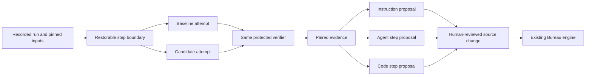

# Replay, evaluation, and step promotion

**Status: design proposal, not implemented behavior.** This document proposes
three bounded systems on Bureau's existing execution model. It does not change
the authoritative rules in [DESIGN.md](../DESIGN.md), add commands, or activate
an improvement loop.

The accompanying interactive design study remains session-only. Its examples
and scores are illustrative, not results from real Bureau or Harbor evaluations.

## User-facing systems

| System | User benefit | Proposed interaction |
|---|---|---|
| Run comparison | Investigate a failing slice without repeating its completed prefix or overwriting history. | Inspect a recorded event, fork an eligible step boundary, change one model or instruction revision, and compare independently verified results. |
| Instruction improvement | Receive small, evidence-backed improvements instead of silently rewritten policy. | Select a recurring failure, propose a focused markdown change and matching machine check, evaluate held-out cases, and review a normal PR. |
| Step promotion | Reuse useful agent work and remove repeated model decisions where they add no value. | Extract an explicit agent step; propose ordinary code only when the supported behavior is invariant and independently verified. |

These are expected benefits, not measured efficiency or reliability claims. A
small local corpus may support manual case selection without justifying automatic
failure grouping or an improvement loop.

## Recommended architecture

Keep Bureau responsible for run lineage, restoration, policy, budgets, and
production execution. Use Harbor as an optional, isolated evaluation process
behind a file/JSON boundary.

Harbor owns evaluation trial mechanics, not Bureau's production work claiming,
leases, routing, or publication. Do not introduce another production engine,
daemon write service, generated execution DSL, or content-addressed artifact store.

| Option | Fit | Trade-off |
|---|---|---|
| **Bureau-native plus isolated Harbor** | Native fork/comparison UX and existing Rust execution, with Harbor's evaluation interfaces. | Requires restorable evidence and a proven integration with the exact Bureau executor. |
| Harbor-first companion | Export frozen cases and use Harbor's built-in agents and viewer for model/instruction research. | Useful earlier, but built-in-agent results do not automatically establish Bureau policy or execution parity. |
| Harbor-format-only | Exchange compatible task/result files while keeping execution entirely in Rust. | Avoids Harbor's Python runtime but is not Harbor-powered execution; recreating the evaluator duplicates infrastructure. |

The recommended boundary permits Harbor's own Python runtime inside an optional
evaluation environment, but introduces **no Python application code** into Bureau.
Task verifiers can be shell, Rust, or Node.

## Existing foundations and gaps

The Bureau source examined for this proposal is
[`5120ced`](https://github.com/TheLarkInn/bureau/tree/5120ced15913018e3ae2244f33ee7a0dad9517ab).
The observations below describe that baseline, not an implemented evaluation feature.

| Surface | Existing behavior | Implication |
|---|---|---|
| `runlog/event.rs` and `runlog/snapshot.rs` | Events record sequence numbers, full step results, usage, checkpoints, and pinned run inputs. | Extend durable evidence rather than creating another history database. |
| `engine/checkpoint.rs` and `engine/resume.rs` | Completed step work can be checkpointed; replay reconstructs the same run's continuation. | An evaluation fork needs a new identity, not recovery with edited history. A Git SHA alone is not an environment snapshot. |
| `cli/run.rs` | `retry` reloads committed configuration and runs again for the earlier work item. | Preserve this default. Historical pinned-boundary evaluation must be explicitly opt-in. |
| `web/replay/replay.js` | Replay and live mode use the same pure overlay reducer. | Extend this projection rather than inventing another interpretation of run events. |
| `adapters/acp/events.rs` | Tool notifications preserve their title, not a complete structured command trace. | Old logs cannot establish command-level determinism. Missing arguments/results must remain missing evidence. |
| `config/pipeline.rs` | Agent and deterministic execution already exist alongside decision/concurrent routing. | Promotion uses existing execution types, not a new learning or generated-recipe type. |
| `engine/execute.rs` | Agent outputs become `Derived`; deterministic outputs inherit request trust. | A change of step kind can change effective downstream trust. Returning a lower trust field from a script does not prevent the executor from overwriting it. |

`DESIGN.md` section 16 explicitly refuses a broad learning system. Implementation
would first require a reviewed, narrow exception for bounded evaluation and
human-reviewed proposals. Other non-goals remain intact.

## What Harbor supplies

Primary documentation and source were inspected at Harbor revision
[`71c39eaf`](https://github.com/harbor-framework/harbor/tree/71c39eafbd134d43ae3f489b5e6488b2a157de65).
Its project metadata identifies version `0.22.0` and requires Python 3.12 or later.
Documentation may move independently of source; implementation must pin and
exercise a compatible release/commit and image rather than assume compatibility.

| Capability | Native support | Bureau's responsibility |
|---|---|---|
| Task/verifier format | `instruction.md`, `task.toml`, environment definitions, `tests/test.sh`, and numeric reward files. | Derive trustworthy cases and protect their grading inputs. |
| Evaluation results | Jobs/trials, JSON configuration/results, artifacts, and a comparison viewer. | Preserve Bureau lineage, all four step outcomes, budgets, and usage provenance. |
| Structured trajectories | ATIF represents messages, tool calls, observations, and metrics. | Capture missing data and declare the completeness/fidelity of each conversion. |
| Conversation loading | `--load-trajectory` accepts native or ATIF history for supported agents; current documentation names Claude Code and Codex. | Restore files independently and reject unsupported context imports. Portable conversion is not lossless. |
| Sequential continuation | `--resume-trajectory` continues supported native sessions across sequential task steps. | Do not confuse this with arbitrary historical tool-call checkpoint restoration. |
| Executable integration | Built-in agents and generic ACP with a local executable distribution. | Bureau consumes ACP today; exposing its executor as an ACP agent would be new Rust integration work. |

Harbor explicitly states that trajectory loading restores **only the conversation**,
not files created by the earlier run. The forkable-trace analogy is useful for the
viewer, but a trace is not an execution snapshot.

Custom `BaseAgent`/`BaseInstalledAgent` integrations are Python classes. Do not
assume an arbitrary Rust executable is automatically a Harbor agent. First prove
the existing local-ACP route instead of adding a Python adapter.

## Run comparison

Distinguish three operations:

1. **View:** project immutable recorded events up to a selected sequence, without
   execution, credentials, or model calls.
2. **Re-run:** execute a fresh attempt from declared inputs in a clean environment,
   producing new evidence under an explicit budget.
3. **Fork:** restore an eligible completed boundary into a new evaluation identity
   and run the selected step or bounded suffix with a pinned variant.

The initial executable boundary is a **completed Bureau step**, not an arbitrary
tool call. The viewer may still inspect every recorded event. Identify occurrences
by run ID and event sequence, not step name or timestamp alone. Actual occurrence
and parent/fork links are acyclic even when the pipeline definition contains retries.

### Restore only what can be established

Retain source state for every relevant repository, immutable plan/resource bytes,
completed results, artifact contents, and a pinned execution-environment description.
Record explicit runtime inputs and permitted network behavior without credential values.

Retain necessary source objects or an ordinary archive/Git bundle with durable run
evidence. The checkout cache is disposable; a SHA whose objects disappear is not
sufficient. Ignored files, external service state, and undeclared dependencies
are not automatically restorable.

Match the completed result and checkpoint unambiguously. Missing, redacted, legacy,
or interrupted evidence remains viewable but non-forkable, with an explicit reason.
Never silently substitute today's checkout or configuration.

Create new run/attempt identities and independent accounting. Do not reuse the
parent's lease owner token, terminal state, dedup disposition, or mutable files.
Refer to parent evidence read-only and materialize isolated copies for the child.

A fresh Bureau agent attempt receives its ordinary explicit `StepRequest`, not
implicit accumulated conversation. Optional native/ATIF import must declare its
supported adapter and fidelity; it cannot reconstruct internal model state.

### Capture and compare evidence

Capture available ACP tool IDs, arguments, completion status/results, relevant
file mutations, explicit decisions, and usage with per-attempt correlation.
Scrub at the write boundary. Missing or redacted fields remain missing; do not
invent arguments by parsing old tool titles.

Keep original scrubbed evidence separate from normalized comparison projections.
Normalization may replace known run-local path prefixes or timestamps, but must
not erase values, ordering, tool versions, or effects that alter semantics.

Extend Rust and browser projections together, preserving old-log read support and
reporting incompatible schemas explicitly. Keep the current v2 step contract unless
a separately justified incompatible change is approved.

## Historical evidence is not automatically ground truth

A merged PR is candidate reference evidence. A failed run is a negative
observation, not a specification.

For a repair case, freeze the pre-change base and the input available at the time.
Establish a meaningful oracle: the targeted regression should fail on the base
and pass with an independently reviewed reference fix under the same verifier.
Distinguish incorrect behavior, flakes, infrastructure errors, blocked inputs,
no-work, and unverified outcomes.

Keep the accepted patch, post-cutoff discussion, and hidden tests out of the
agent's prompt, worktree, Git history, cache, and accessible filesystem. Public
repository tests may remain useful; protected grading must remain independent.

Deduplicate related issue/patch families before splitting development, validation,
and held-out cases. Repeated attempts on one case are not independent cases.
Once holdout feedback influences a revision, use fresh held-out evidence to confirm it.

Public historical PRs may already be in model training data. Report that limitation
and add forward-collected cases rather than claiming contamination-free evaluation.

## Evaluation boundary

Use reviewed Harbor task files directly, with a manifest referencing the cases,
source evidence, candidate/baseline bytes, verifier, image/executor revisions, and
repetition policy. This is not a new executable DSL or compiled pipeline format.

Require explicit trial, concurrency, time, and spend limits before cost-bearing
work. Import versioned per-trial results and complete/partial artifacts through
file/JSON interfaces. Unknown cost remains unknown, never zero. Missing or malformed
rewards must not turn into success-shaped defaults.

Use ordinary local evaluation directories, proposed under
`BUREAU_HOME/evaluations/<evaluation-id>/`. Keep reviewed source/config in Git;
do not put runtime status there or create another issue/PR database.

An evaluation launch must not smuggle model credentials into ordinary deterministic
production steps, which receive none today. Do not expose host-home mounts,
production forge tokens/state/leases, or a Docker socket to the agent.

Harbor's default network baseline is public and generic ACP permission mode defaults
to allow. Set explicit restricted policies and verify actual enforcement on the
selected local backend. Keep the verifier protected, using a separate environment
and declared artifact transfer where appropriate.

Cancellation must stop both the supervised process tree and the exact owned
evaluation containers. Killing a CLI alone does not clean up resources managed by
a separate container runtime.

An early integration spike should invoke fake-agent and deterministic steps through
a small Rust ACP endpoint around Bureau's existing executor. It must not call
Harbor recursively, duplicate production routing, publish a PR, or auto-install
plugins. Prove policy, cancellation, result, and usage semantics before claiming
Bureau parity. Until then, label built-in-agent evaluations as such.

## Instruction improvement

Use a bounded ordinary pipeline: select a reproducible failure pattern, propose a
minimal agent/skill markdown change, pair it with a deterministic machine check,
run paired evaluation, and prepare a normal reviewable proposal.

The candidate cannot widen production permissions, weaken approval policy, rewrite
protected held-out tests, or change its own acceptance policy. Model and tools remain
in standard agent frontmatter, not duplicated in role YAML.

Report regressions, missing evidence, sample size, and cost/latency changes as well
as successes. A cheaper failed run is not an improvement. An overfit candidate is
rejected even if it improves the examples used to construct it.

Activation follows human review and the normal merged-config reconcile path.
Rejection preserves the current resource; rollback is an ordinary reviewed revert.
This is instruction maintenance, not model training or autonomous self-modification.

## Step promotion

Measure separate properties rather than one "determinism score":

| Property | Evidence |
|---|---|
| Correctness | Independent oracle outcomes, including negative inputs. |
| Outcome repeatability | Within-case consistency across fresh attempts, with case-level uncertainty and flake reporting. |
| Action repeatability | Structured operations, arguments, and order or justified partial order. |
| Effect equivalence | Equivalent outputs, file changes, permitted external effects, and failure behavior. |
| Generalization | Distinct held-out cases within a declared supported domain. |
| Operational value | Measured model calls, resource use, latency, and cost, including the cost of collecting evidence. |

The same five commands can behave differently because of network responses,
randomness, time, tool versions, or hidden filesystem state. Different action
sequences can also produce equally correct results.

Do not choose a universal success percentage without a corpus and risk decision.
A reviewed promotion policy specifies the supported domain, required case categories,
confidence method and minimum bound, regression constraints, and resource limits.
Perfect-looking small samples are not proof.

### Promote to an agent step

Extract a minimal useful slice behind the current v2 request/result contract and
artifact rules. Draft a standard agent resource, least-privileged role, and pipeline
entry with all four outcomes routed explicitly. Evaluate isolation and representative
end-to-end behavior before proposing activation.

Keep the agent when useful judgment or action choice varies. Stable outcomes do
not require identical traces.

### Promote to a deterministic step

Use repeated traces to discover candidates, not as executable source. Author a
readable parameterized script or Rust tool with explicit preconditions, dependencies,
output schema, and permitted effects.

Compare independent expected outcomes and accepted agent behavior across ordinary,
held-out, mutation, and out-of-domain cases. Include partial failure, cancellation,
timeouts, missing inputs, and idempotence where required.

Use the existing `deterministic` type and ordinary v2 results/artifacts. Unsupported
inputs must produce explicit outcomes/routes, never a silent paid agent fallback.

The replacement must not widen grants or raise effective downstream trust. Since
the deterministic executor overwrites emitted trust with request trust, returning
`Derived` from a script is insufficient. Initially reject promotions that would
raise trust under current semantics instead of adding an unapproved override.

Human review covers the actual code, role/pipeline change, supported domain, evidence,
and rollback. Tie that evidence to exact revisions. Relevant changes make it stale
and require explicit re-evaluation, not a new cron or statistical-learning service.

## Delivery sequence

1. Review the narrow specification exception and new data/policy formats.
2. Define trustworthy cases and offline positive, negative, flaky, and infrastructure fixtures.
3. Prove the isolated Harbor/Rust boundary with fake and deterministic steps.
4. Add structured evidence and durable, restorable boundary descriptors.
5. Implement opt-in isolated forks without changing retry/recovery defaults or permitting publication.
6. Add paired evaluation and comparison to the existing replay projection.
7. Add reviewed instruction proposals, then separate agent/code promotion eligibility.
8. Complete accessible lineage, blocked/rejected/stale states, and reduced-motion UI behavior.

Start with a small evidence/case/evaluation loop. Later automation depends on
corpus sufficiency and demonstrated value, not merely a working prototype.

Reuse the existing `runlog`, `engine`, `adapters/acp`, `process`, `git`, `contract`,
CLI, and canvas surfaces. Preserve the 17-command cap. Any new module or cross-module
dependency updates `dylint.toml` in the same change.

Every layer ships with offline tests using fake adapters, local Git fixtures, and
fake Harbor CLI/results. Real container/model integration is separately opt-in.
Cover immutable parents, repeated step names, missing objects, redaction, legacy
logs, invalid rewards, unknown cost, budget exhaustion, container cleanup, prohibited
publication, overfit rejection, all four outcomes, and trust-changing replacements.
Run the repository's existing required gates for implementation changes.

## Primary sources

- [Harbor task format and verifier isolation](https://www.harborframework.com/docs/tasks)
- [Harbor agent interfaces](https://www.harborframework.com/docs/agents)
- [Harbor results and comparison viewer](https://www.harborframework.com/docs/run-jobs/run-evals)
- [Trajectory loading and conversation-only restoration](https://www.harborframework.com/docs/run-jobs/load-trajectory)
- [Sequential multi-step context](https://www.harborframework.com/docs/tasks/multi-step)
- [Agent Trajectory Interchange Format](https://www.harborframework.com/docs/agents/trajectory-format)
- [Pinned runtime metadata](https://github.com/harbor-framework/harbor/blob/71c39eafbd134d43ae3f489b5e6488b2a157de65/pyproject.toml)
- [Pinned generic ACP integration](https://github.com/harbor-framework/harbor/blob/71c39eafbd134d43ae3f489b5e6488b2a157de65/src/harbor/agents/installed/acp.py)
